# AWS Glue Cost Optimisation: How We Cut Our Bill by 65% (Without Breaking Anything)

*We had about 330 Glue jobs in total, with 108 running in production and the rest spread across dev
and staging. Almost all of the cost came from production. Together they were costing us roughly $200
a day. We got that down to about $70 a day, without rewriting any job or changing what they produce.
Here's exactly how.*

---

First, a quick word in case you're new to this: **AWS Glue** is a service that runs data jobs
(read some data, change it a bit, write it back out). You pay Glue by the second (with a one-minute
minimum per run) for the compute it uses. That compute is measured in **DPUs**. Think of a DPU as
"one chunk of CPU + memory." More DPUs running for longer = a bigger bill.

Okay. Here's the short version.

Our Glue bill was leaking money. We stopped the leak. **Daily spend went from about $200 to about
$70.** A separate CloudWatch bill (the monitoring service) also dropped from about $70 a day to about
$40. And nothing downstream changed: same outputs, same data, same schedules.

The surprising part? **Most of our jobs were paying for computers that did nothing.** Teams leaned on
Auto Scaling to "just figure out the right size," but on short jobs it can't. A job set up with 10
workers and left on Auto Scaling often only needed *one*. Multiply that waste across a few hundred
jobs and you get a silly bill.

Let me walk you through what we found and how we fixed it.

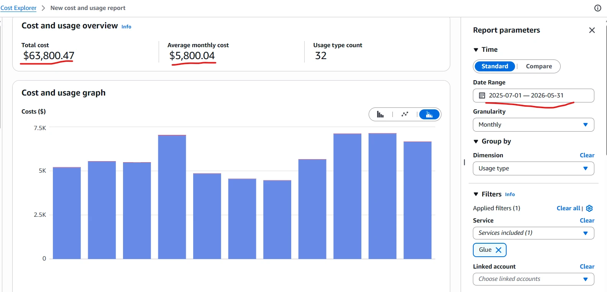
*Where we started: about $200 a day, and no idea which jobs were to blame.*

---

## First, make the cost visible

Before you can fix a bill, you have to know where the money is going. By default, Glue shows you one
big number for "Glue spend," your total DPU spend. It won't tell you *which* job is the expensive
one. So the first job was simply making the cost visible. Two steps.

**Step one: tag everything.** A tag is just a label you stick on a job. We added three labels to
every job:

| Tag | Value | Why it helps |
|---|---|---|
| `env` | `prod` / `stg` / `dev` | tells us if it's production, staging, or dev |
| `squad` | the team that owns it | so we know who to talk to |
| `job-name` | the job's own name | lets us see the cost of **each job on its own** |

That last label is the important one. Once every job carries its own name as a tag, the AWS cost
dashboard can finally show you a cost *per job*. Now you can see your most expensive jobs and start
at the top of the list.

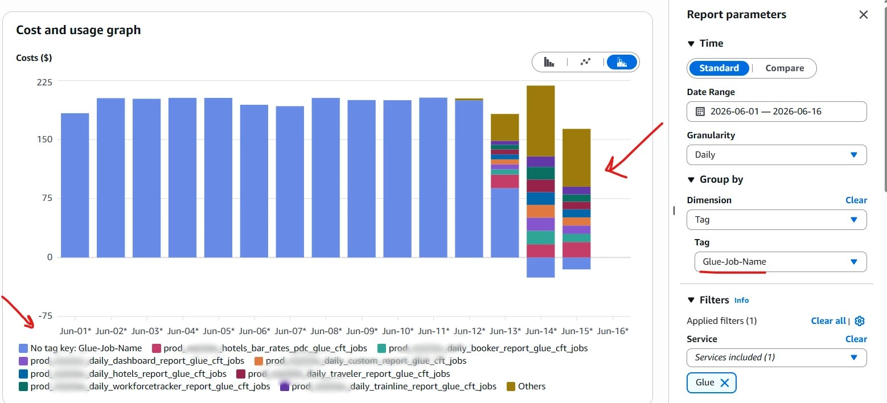
*After tagging: now we can see exactly which jobs cost the most.*

You don't have to tag jobs by hand. The AWS CLI can do it in bulk: list every Glue job with
`aws glue get-jobs`, then loop over the names and call `aws glue tag-resource` for each one to add
the `env`, `squad`, and `job-name` tags. (You can do the same with the SDKs, like `boto3` in Python.)

A few things worth knowing before you run something like that:

- `tag-resource` adds tags **without** rewriting the rest of the job's settings, so it's safe and
  fast (no need to read and re-save the whole job).
- Tag jobs one at a time and let a single failure skip past instead of stopping the whole run, most
  failures are just a permissions issue on one job.
- Don't be shocked if your permissions block you from tagging some jobs. That cost us an afternoon.
- Set `env` correctly per job (prod / stg / dev). The simplest approach is to run it once per
  environment, or look the value up from each job's name or existing tags.

**Step two: turn on monitoring.** AWS already gives you **job run monitoring** built into the Glue
console, every run's status, duration, and DPU usage, and that alone is enough to get started. In our
case, though, we wanted everything in one place alongside the rest of our systems, so we use
**Datadog**. We configured our AWS account to send Glue data to Datadog and turned on **Datadog Data
Jobs Monitoring**, which gives us every Glue job in a single view. We also switched on Glue's
built-in job insights. One useful cost detail:

- **Job insights** → writes to logs. Basically free.
- **`--enable-metrics`** → sends extra custom metrics that you *pay for*. It's genuinely useful when
  you want to analyze a single job, see how it uses its resources (CPU, memory, workers), and diagnose
  that one job on its own. But don't leave it on for jobs nobody is watching (more on this later; it's
  a real line on the bill). **Turn it off again once you're done diagnosing** so it stops billing.

Only *after* the numbers were flowing could we make decisions based on facts instead of guesses.

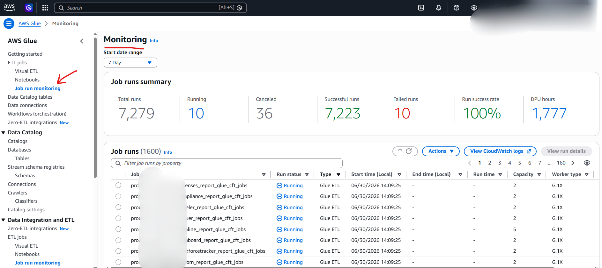
*Glue's own job run monitoring in AWS: every run's status, how long it took, and the DPU capacity it used.*

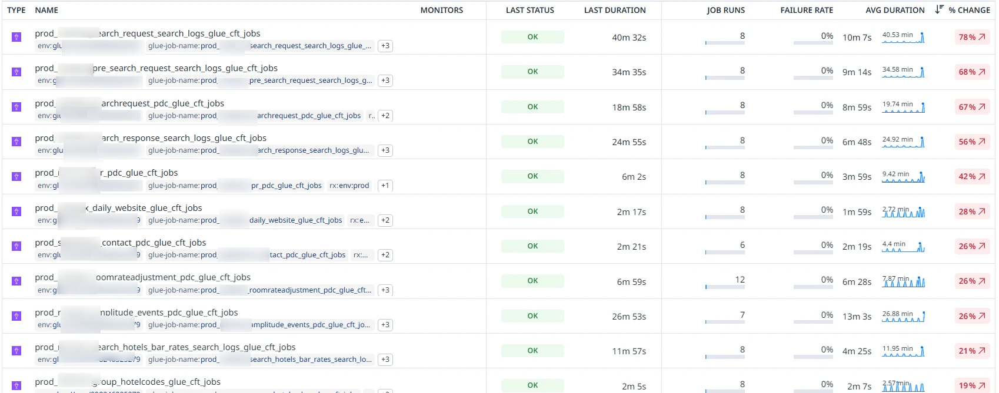
*Datadog Job Monitoring: every Glue job in one place: how long it ran, whether it failed, and the trend.*

---

## The big one: Auto Scaling can't rescue a short job

This is the idea that saved us the most money, so stay with me for a minute. It's simpler than it
sounds.

Remember: **Glue charges for the workers it turns on, not for the workers that actually do work.**
That one sentence is the whole story.

"Auto Scaling" means Glue adds and removes workers for you automatically (it's available on Glue 3.0
and later). Here's how it behaves, straight from the
[AWS Auto Scaling docs](https://docs.aws.amazon.com/glue/latest/dg/auto-scaling.html):

- A job **starts small**, allocating only the capacity it needs at startup, not the full worker count
  you configured.
- As Spark asks for more, Glue **adds workers on demand**, usually within seconds.
- But it only *removes* a worker once that worker has been **idle (no active tasks, and no shuffle
  data it still needs to hold) for about 600 seconds, a full 10 minutes**.

See the trap? **Glue adds workers in seconds but removes them in 10-minute steps.**

So if your job finishes in *less than 10 minutes*, those extra workers never get removed in time. Say
a job briefly jumped to 5 workers but really only needed 1. You **pay for all 5 until the job ends**,
and it didn't even run faster, because the extra workers had nothing to do.

"Fine," you might say, "I'll just lower that 10-minute timeout." You can't, not reliably. When Auto
Scaling is on, Glue controls those settings, and trying to override them usually doesn't stick. The
one setting that *always* works is the **number of workers**. Set it to 2 (the lowest Glue allows for
G.1X), and the job can never jump to more than 1 extra worker. Done.

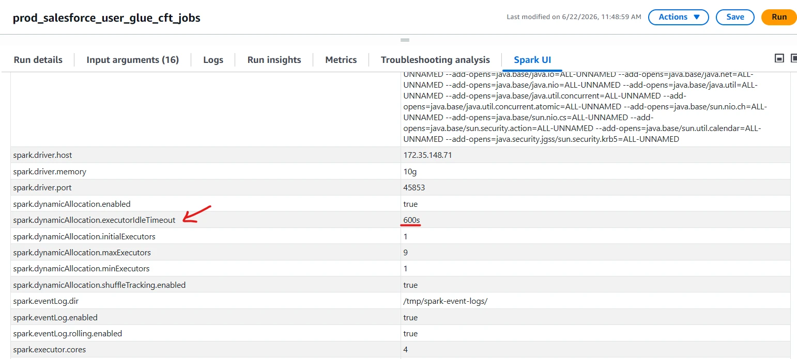
*Here it is in the settings: idle workers aren't removed for 600 seconds.*

And here's the kicker: that 600 seconds isn't even normal. The underlying engine (Apache Spark)
removes idle workers after just **60 seconds** by default. Glue bumps that up **10× higher**, to 600
seconds. So Glue is far slower to let workers go than plain Spark, which is exactly why short jobs
never shrink in time. (You can see the defaults yourself in the
[Spark configuration reference](https://spark.apache.org/docs/latest/configuration.html).)


*Plain Spark lets idle workers go after 60 seconds. Glue stretches that to 600, 10× slower.*

So here's the rule we live by now:

> **Auto Scaling isn't useless on short jobs, it just isn't very effective. It still avoids spinning
> up the full worker count from the start, but because it only releases idle workers after 10 minutes,
> a job that finishes sooner never gets the chance to shrink. For short, steady jobs, set the worker
> count low yourself. Don't trust Auto Scaling to shrink them; it can't do it in time.**

Switching short jobs from 10 workers down to 2 cut their cost by **45–60%**, with the same or faster
runtime, across dozens of jobs. This single change was most of our savings. Really.

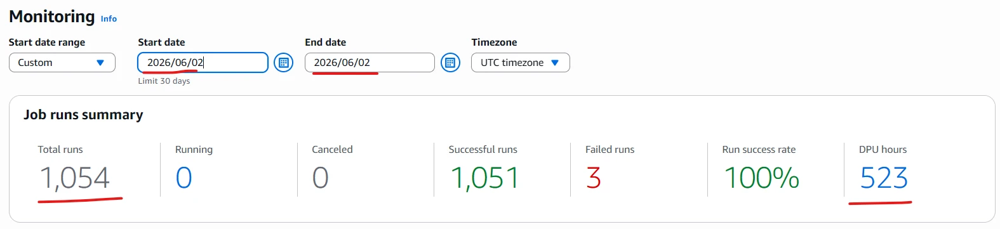
*Compute usage before: lots of workers, almost no actual work.*

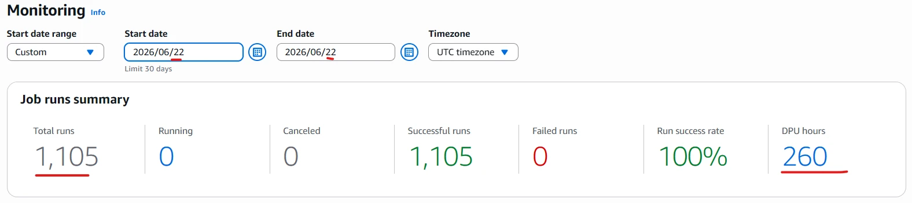
*Compute usage after lowering the worker count: same results, a fraction of the cost.*

---

## Read it once: cache the data you reuse

Here's a sneaky one, and it hits you twice: as extra **storage requests** from re-reading the same
files, and as wasted **compute**, because the job keeps re-reading instead of reusing data it already
loaded, so it runs longer.

That same report job read a table from S3 (Amazon's file storage) into memory… and then used that
same data **six times** further down (a few joins, some filters, a summary). The catch: Spark is
*lazy*. The data you loaded isn't really saved; it's more like a recipe. Every time you use it again
without caching, Spark **re-runs the whole recipe from scratch**, which here meant **re-reading
~6,581 files from S3, six times over**.

The numbers were ugly: about **40,570 read requests per run** just in S3 reads, before counting the
wasted compute of re-reading the same data again and again.

The fix is one line, right after the first read:

```python
df = spark.read.json("s3://.../source/")   # expensive: thousands of small files
df.cache()        # keep this data in memory...
df.count()        # ...and load it right now, so the next 6 uses are free
```

`cache()` tells Spark "hold onto this." The `count()` forces it to actually load the data *once*.
After that, the other five uses read from memory instead of S3. The result:

- Read requests dropped about **6×** (~40,570 → ~6,795 per run), which cut the S3 read cost in step.
- Compute dropped too: no more redoing the same read five extra times.

> **Rule of thumb:** if you use the same data more than once (especially data loaded from many
> files), `cache()` it after the first read and follow it with `count()`. It's the lowest-risk win here.

One caveat: caching uses memory. If you only use the data once, don't cache it; that just wastes
memory for no reason. AWS recommends this exact pattern for repeated DataFrames in
[Optimize shuffles](https://docs.aws.amazon.com/prescriptive-guidance/latest/tuning-aws-glue-for-apache-spark/optimize-shuffles.html).

---

## The classic trap: too many tiny files

This one explains why some "tiny" jobs were running for *hours*.

Quick background: Spark (the engine inside Glue) creates roughly **one task per input file**. A task
has overhead. So if you hand it a huge number of tiny files, it spends all its time on bookkeeping
instead of real work. Some of our jobs were reading folders stuffed with hundreds of thousands of
tiny files:

| Job | Number of files | Actual data | Which means… |
|---|---|---|---|
| BAR-rates converter | ~298,000 files | ~863 MB | ~3 KB per file |
| Rate-sync transform | ~83,000 files | ~155 MB | about 1 record per file |
| LPR converter | ~13,000 files/day | **~1.8 MB/day** | ~140 *bytes* per file |

Read that last row again. Two to four **hours** of compute every day… to process **1.8 megabytes**
of data. The cluster wasn't really computing anything; it was drowning in tiny-file overhead. The
logs basically said so:

```
ERROR AsyncEventQueue: Dropping event from queue appStatus ... listeners too slow ...
rate at which tasks are being started by the scheduler
```

That's not a data problem. That's "way too many tiny tasks."

When the read really is the problem, you don't have to fix the upstream files. You can tell Glue to
**bundle the small files into bigger chunks as it reads them**:

```python
sourceData = glueContext.create_dynamic_frame.from_catalog(
    database   = glueDbName,
    table_name = glueTableName,
    additional_options = {
        "groupFiles": "inPartition",
        "groupSize":  "10485760"   # bundle into ~10 MB chunks
    },
    transformation_ctx = "sourceData"
)
```

This only changes how Glue *reads*: it happens in memory, your actual files don't change, and there
is **no extra storage cost**. A 10 MB chunk size turns ~298,000 one-file tasks into a few dozen
sensible ones. Hours turn into minutes.

One honest caveat: this only helps when the **read really was the bottleneck**. We added it to a few
jobs and saw no improvement, because their slow part was elsewhere (a JDBC source, a shuffle, the
write side). If a job is slow for some other reason, grouping the input files won't move the needle.

**One important warning:** this bundling helps jobs that are stuck on too many files. It *hurts* tiny
jobs that were already fine; you'd be slowing down work that was happily running in parallel. We
learned this the hard way. And if one script is shared by many jobs (ours powered **9 jobs from a
single file**), make the bundling a switch each job can turn on or off, so you don't break the others.
A shared script gives you 9× the benefit *and* 9× the risk. Handle with care.

If you want the official version of all this, AWS covers it well in
[Parallelize tasks](https://docs.aws.amazon.com/prescriptive-guidance/latest/tuning-aws-glue-for-apache-spark/parallelize-tasks.html)
and [file grouping for DynamicFrames](https://docs.aws.amazon.com/glue/latest/dg/grouping-input-files.html).

---

## Fix the writing side too: stop producing thousands of tiny files

Everything above was about *reading* too many small files. The exact same problem can happen on the
*writing* side, and it's just as expensive, only now **you're the one creating the mess** for the next
job downstream.

We had a job that wrote its output as **thousands of 11 KB files** every run. Usually this comes from
one of two things:

- **Too many partitions in memory.** Spark writes (at least) one file per partition, per output
  folder. If your data is split into hundreds of partitions when it's written, you get hundreds of
  files, each tiny.
- **High-cardinality `partitionBy`.** Partitioning the output by a column with thousands of distinct
  values (a hotel code, a customer ID) creates a folder for every value, and each folder gets its own
  little fragment from every partition. That's how you end up with thousands of 11 KB files for a
  dataset that's only tens of MB in total.

**The fix is to control how many files you write, right before the write.** Two cheap tools:

```python
# Reduce the number of output files (cheap, no full shuffle):
df.coalesce(4).write.parquet("s3://.../output/")

# Or, when you must partition by a column, group rows by that column first
# so each value writes one file instead of one fragment per input partition:
df.repartition("hotelcode").write.partitionBy("hotelcode").parquet("s3://.../output/")
```

A few rules of thumb that kept us out of trouble:

- **Aim for around 128 MB per output file.** That's the sweet spot AWS recommends, big enough to read
  efficiently, small enough to stay parallel.
- **For tiny datasets, don't overthink it:** `coalesce()` down to a handful of files (even one) and
  move on.
- **Prefer `coalesce()` over `repartition()` when you're only *reducing* file count**, because
  `coalesce()` avoids a full shuffle. Use `repartition("col")` only when you need to group rows by a
  column before a `partitionBy` write.
- **Question every `partitionBy`.** If downstream queries don't actually filter on that column,
  partitioning by it just buys you the tiny-files problem for nothing. Drop it.

The payoff is double: your own write step gets faster, and every job that reads this output later
starts from a clean, sensibly-sized set of files instead of inheriting your small-files problem.

---

## Match the size to the real bottleneck (not your gut)

Once the file bundling is in, shrink the cluster, but shrink based on what the numbers show, not
what you assume.

Quick story. One job *looked* like it needed more power. The metrics said the opposite:

- The **"driver"** (the single coordinator process) was nearly maxed out; it was holding an index of
  298,000 files in memory.
- The **"executors"** (the worker processes) were almost idle, barely any CPU or memory used.

So the job wasn't short on workers. It was choking on that one coordinator. The fix is *not* "add more
workers." It's "fix the tiny-files problem, then shrink down to 2 workers." Adding workers here would
just burn money. AWS says the same thing in its tuning guide: if CPU load is low, you probably won't
benefit from scaling cluster capacity, and you should add workers only until you start seeing idle
ones (see
[Scale cluster capacity](https://docs.aws.amazon.com/prescriptive-guidance/latest/tuning-aws-glue-for-apache-spark/scale-cluster-capacity.html)
and [Minimize planning overhead](https://docs.aws.amazon.com/prescriptive-guidance/latest/tuning-aws-glue-for-apache-spark/minimize-planning-overhead.html)).

Compare that to a job that genuinely *was* working hard; its workers were running at 92% CPU on 205
million records. *That* job really uses its workers, and you should leave them alone. Same "10
workers" setting: wasteful on one job, correct on the other. **Always check before you change.**

> **Coordinator maxed out? Fix the files and shrink. Workers maxed out? Leave the workers.**

One more trap to check: several jobs named `daily_something_report` were actually running **every 30
minutes, about 48 times a day**, kicked off by an old schedule nobody remembered. For those, the
cost came from *how often they ran*, not from the data. Always check a job's real run history against
its name before you tune anything.

---

## Glue Flex: about 34% off for jobs that aren't urgent

For batch jobs that don't need to finish *right this second*, **Glue Flex** runs them on spare
capacity for about **34% less**. The trade-off is runtime: because Flex uses non-dedicated capacity,
jobs can take longer to start (a cold start while Glue finds spare workers) and can run slower
overall, since workers may be assigned gradually and are a bit less predictable. So:

- **Good for:** overnight jobs and reports that have some slack in their timing.
- **Skip it for:** jobs that run on a tight schedule (a late start could overlap the next run) and
  very short jobs (the startup delay eats the savings).

Combined with lowering the worker count, Flex took several jobs to a small fraction of their old
cost. One report job dropped from about $416/month to about $92/month at 3 workers on Glue 5.0 with
Flex, and part of that came from a one-line caching fix I'll cover next.

A quick honesty note about the screenshot below: I switched these jobs to Flex **and** lowered their
worker counts at the same time. So the drop you're seeing is the result of **both** changes together,
not Flex by itself. That's just how I rolled it out. If you want to measure each change exactly,
change one thing at a time.

If you want the full details on how Flex works and when to use it, AWS's own write-up is a good read:
[Introducing AWS Glue Flex jobs: Cost savings on ETL workloads](https://aws.amazon.com/blogs/big-data/introducing-aws-glue-flex-jobs-cost-savings-on-etl-workloads/).

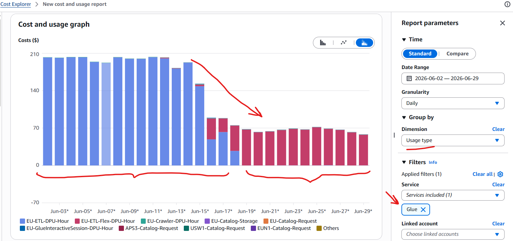
*Cost after moving non-urgent jobs to Flex **and** lowering worker counts at the same time; the drop is the two changes combined.*

---

## The boring cleanup that quietly adds up

None of these are exciting. All of them save money.

- **Turn off unused custom metrics.** Paying for metrics nobody looks at is pure waste. In our case
  **`--enable-metrics`** (and the **`--enable-observability-metrics`** insight metrics) had been
  *accidentally left on for a couple of jobs* after some earlier debugging, quietly billing the whole
  time. Turning them off where unused is what dropped our
  **CloudWatch bill from about $70/day to about $40/day.**
- **Remove unused database connections.** Many jobs had a database connection attached that the code
  never used, and it added a slow startup step every single run for no reason.
- **Fix silly timeouts.** One 6-minute job had a 48-hour timeout. If it ever got stuck, it could run
  up a bill for *two days* before anything stopped it. We set timeouts to about 60 minutes.
- **Allow only one run at a time** once jobs are fast and you've confirmed they don't need to overlap.
  Bonus: it stops two runs from clashing over the same output.
- **Upgrade the Glue version** (4.0 → 5.x) where it's safe. We saw 10–22% gains on jobs that were
  genuinely compute-heavy. But on jobs stuck reading lots of files, the upgrade barely helped,
  because compute was never the problem. Don't expect a version bump to fix the tiny-files issue.
  (AWS explains the per-version improvements in
  [Use the latest AWS Glue version](https://docs.aws.amazon.com/prescriptive-guidance/latest/tuning-aws-glue-for-apache-spark/latest-version.html).)

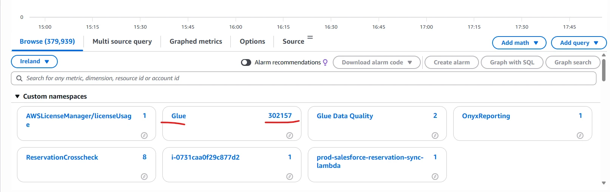
*The paid custom metrics each job was sending, most of them watched by nobody.*

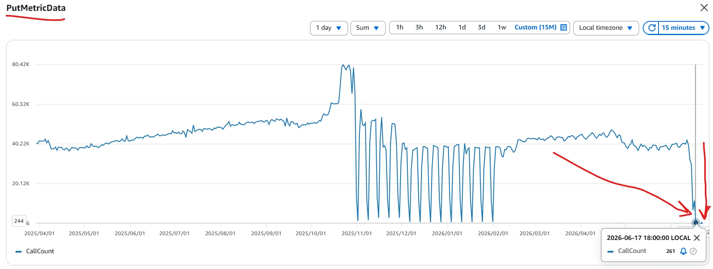
*The volume of metric writes: the hidden reason the CloudWatch bill was high.*

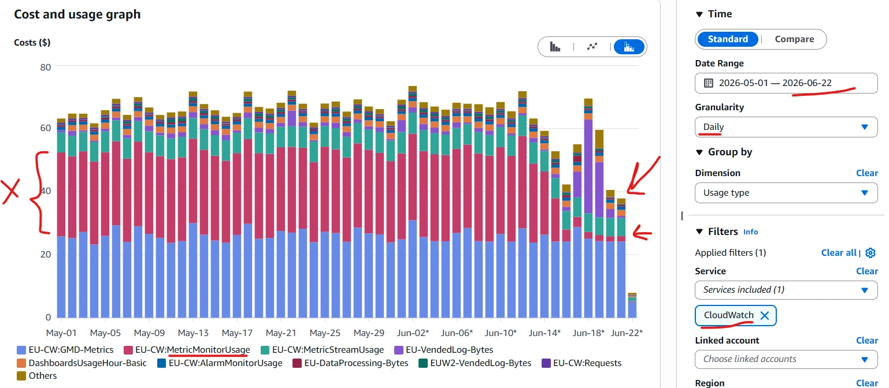
*CloudWatch's daily cost after turning off the unused metrics.*

---

## A security issue you'll probably find too

When you read through hundreds of job settings, you find things. We found a job with its **database
password sitting in plain text** in the job's settings, readable by anyone who could view the job,
and showing up in the console, audit logs, and run logs. That's a real security risk.

The fix is standard: move the password into **AWS Secrets Manager**, have the job fetch it at run
time, give the job permission to read only that one secret, remove the password from the settings,
and **change the password** (treat the old one as leaked). Nice bonus: this also fixed that job's
repeated "password expired" failures.

While you're in there, watch for jobs that *add* rows on every run with no safeguard. They can quietly
**duplicate data each time they run**. Have them overwrite the day's data instead.

---

## So what actually moved the needle?

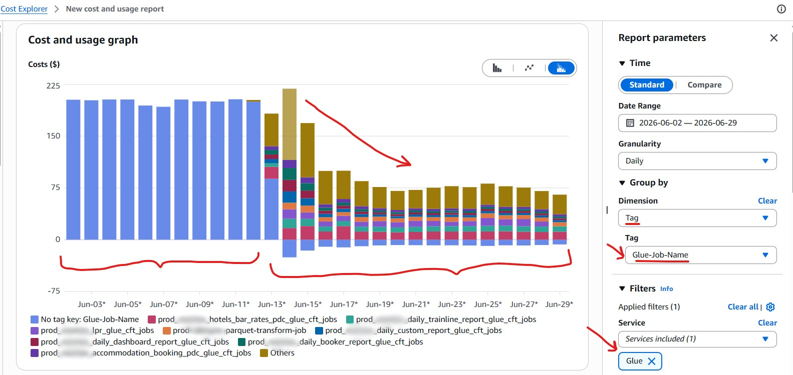
*The result: about $200/day → about $70/day. Same outputs, around 65% cheaper.*

| Change | Typical impact |
|---|---|
| 10 → 2 workers on short jobs | **45–60% cheaper**, same or faster |
| Bundling small files on read | hours → minutes on file-heavy jobs |
| Glue Flex on batch jobs | **about 34% cheaper** |
| Caching reused data | read once instead of 6× → **far fewer S3 reads per run**, plus less compute |
| Turning off unused metrics | CloudWatch **~$70 → ~$40 per day** |

Overall: **about $200/day → about $70/day on Glue, roughly 65% off, plus a separate CloudWatch drop
from about $70/day to about $40/day, with no change to any output.** The
heaviest report jobs saw the biggest drops; several went from about $500/month to about $130/month
each.

**Annually, that adds up to around $160/day, or roughly $58,000 a year (about $47,000 on Glue and
about $11,000 on CloudWatch), and that's before tax, so the real number is higher still. All of it
from config changes and a few lines of code, with zero change to a single output.**

---

## The whole thing as a checklist

Steal this:

1. **Tag every job** (environment, team, job name), then sort jobs by cost.
2. **Turn on monitoring** (free insights always; paid metrics only where you actually watch them).
3. **Check how often each job runs vs. its name**: find the "daily" jobs running 48×/day and fix
   that first.
4. **Short jobs (under 10 min): set the worker count low (start at 2).** Don't rely on Auto Scaling
   to shrink them.
5. **Slow jobs: look for too many tiny files.** Roughly one task per file? Turn on file bundling
   (make it a switch if the script is shared).
6. **Check whether the coordinator or the workers is the bottleneck** before resizing. Coordinator →
   fix files and shrink. Workers → leave them.
7. **Cache any data you use more than once** (and follow it with `count()`): it stops Spark from
   re-reading the same files from S3. One line, big saving.
8. **Fix the output side**: merge tiny output files toward ~128 MB; avoid splitting into thousands.
9. **Use Flex** for non-urgent batch jobs; skip it for tight schedules or very short jobs.
10. **Clean up:** sane timeouts, one run at a time, remove unused connections, upgrade where it helps.
11. **Check every change** against a "before" snapshot (row count, output, runtime, cost). Keep each
    change easy to undo.

---

## Last thought

There's no magic setting here. It came down to **looking at the numbers before changing anything**,
and finally understanding one odd truth about how Glue charges you: **Auto Scaling protects you from
having too few workers, not from paying for too many on a short job.**

Once that clicks, a 65% cut stops feeling like a big win and starts feeling like the bare minimum.

---

## Further reading

If you want to go deeper, these are the AWS pages that back up everything above:

- [Using auto scaling for AWS Glue](https://docs.aws.amazon.com/glue/latest/dg/auto-scaling.html)
- [Tuning AWS Glue for Apache Spark: performance-tuning strategies](https://docs.aws.amazon.com/prescriptive-guidance/latest/tuning-aws-glue-for-apache-spark/performance-tuning-strategies.html)
  (the parent guide for the links below)
- [Scale cluster capacity](https://docs.aws.amazon.com/prescriptive-guidance/latest/tuning-aws-glue-for-apache-spark/scale-cluster-capacity.html)
- [Use the latest AWS Glue version](https://docs.aws.amazon.com/prescriptive-guidance/latest/tuning-aws-glue-for-apache-spark/latest-version.html)
- [Reduce the amount of data scan](https://docs.aws.amazon.com/prescriptive-guidance/latest/tuning-aws-glue-for-apache-spark/reduce-data-scan.html)
- [Parallelize tasks](https://docs.aws.amazon.com/prescriptive-guidance/latest/tuning-aws-glue-for-apache-spark/parallelize-tasks.html)
- [Optimize shuffles](https://docs.aws.amazon.com/prescriptive-guidance/latest/tuning-aws-glue-for-apache-spark/optimize-shuffles.html)
- [Minimize planning overhead](https://docs.aws.amazon.com/prescriptive-guidance/latest/tuning-aws-glue-for-apache-spark/minimize-planning-overhead.html)
- [Optimize user-defined functions](https://docs.aws.amazon.com/prescriptive-guidance/latest/tuning-aws-glue-for-apache-spark/optimize-user-defined-functions.html)
- [Introducing AWS Glue Flex jobs: cost savings on ETL workloads](https://aws.amazon.com/blogs/big-data/introducing-aws-glue-flex-jobs-cost-savings-on-etl-workloads/)
- [Spark configuration reference](https://spark.apache.org/docs/latest/configuration.html)

---

*Every change above was applied one job at a time and checked against a "before" snapshot (row
count, output, runtime, and cost), with each change easy to roll back. Measure, change, check.
Repeat.*
